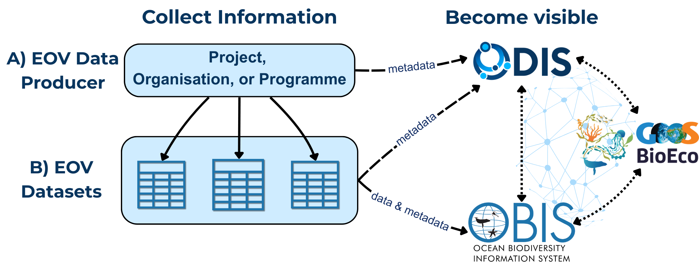
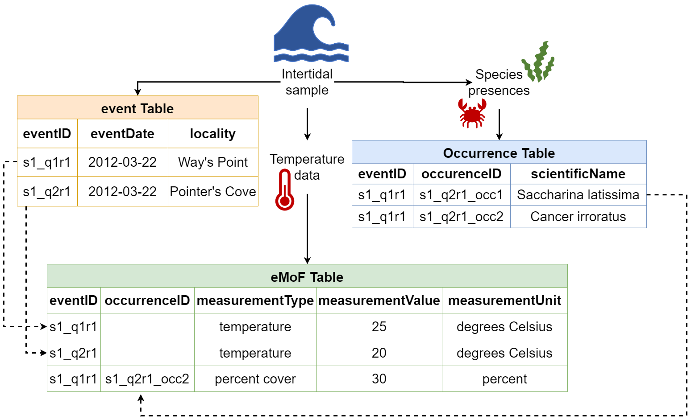
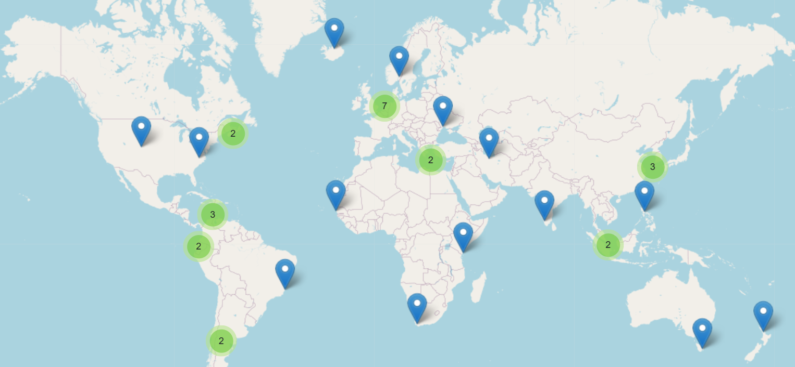

# Data and information Management for EOVs

GOOS approach to data management is aligned with open data and FAIR (Findable, Accessible, Interoperable, Reusable)[^1] practices. All EOV data and information is valuable, thus effective data management practices are essential to ensure it remains accessible and (re)usable for future generations. This section explains how you can contribute data to global ocean observing and ensure your data and information is accessible, interoperable and sustained. We include instructions for different scenarios: an individual submitting data, or existing data centres.

**Please follow these practices carefully, as BioEco EOV data FAIRness relies on compliance with the guidelines below.[^2]** 

The recommendations below are aligned with the [IOC Strategic Plan for Ocean Data and Information Management](https://oceanexpert.org/document/31325) (2023–2029), the [UN Ocean Decade’s original Implementation Plan](https://unesdoc.unesco.org/ark:/48223/pf0000377082), its subsequent [Data and Information Strategy](https://unesdoc.unesco.org/ark:/48223/pf0000385542), as well as the latter’s upcoming Implementation Plan.

Two main IOC-UNESCO digital systems help ensure global data compatibility: the [Ocean Data and Information System (ODIS)](https://odis.org)[^3] and the [Ocean Biodiversity Information System (OBIS)](https://obis.org/)[^4]. Compatibility with ODIS and OBIS ensures compatibility with a broader IOC-UNESCO digital ecosystem, further ensuring that EOV data will be visible to the global community and FAIR.

Before reading on, please note these important points:

1. As a **minimum**, you must ensure information describing your EOV data (i.e. metadata) are visible in ODIS. Regardless of where the actual data is stored, evidence of its existence must be findable within ODIS.  
2. BioEco EOV data is successfully managed if it is discoverable in the [**GOOS BioEco Portal**](https://bioeco.goosocean.org/)**.** The BioEco Portal is the central point of access and coordination of BioEco EOV observing programmes. Data visible in ODIS will automatically be visible in the BioEco Portal and vice versa.

3. If data is published to OBIS, it will also be visible in ODIS and the BioEco Portal. You do not need to also add it elsewhere, unless there is extra information you would like to include.

We differentiate between the **EOV datasets** and the **EOV data producers** (e.g., the organization, project, or monitoring program that generated the data) throughout this document. This distinction is made to emphasize that both the data and its source \- the data producer \- need to be managed and made visible. 

The following points summarise the main data management steps:

1. Become discoverable: ensure the data producers (e.g., organisation, programme, project, etc.) and datasets are visible in ODIS 
2. Prepare the required metadata about the data producer and the datasets  
3. Publish EOV data (e.g. OBIS)  
4. Verify discoverability in ODIS

Not all steps may be relevant for you, but **Step 1 is the minimum required** to ensure your data contributes to EOVs. .

*Figure 1\. High-level example of data and metadata flows to ensure A) EOV data producers and B) EOV datasets become visible in the IOC Digital Ecosystem. Note the links between OBIS, GOOS BioEco Portal, and ODIS \- data visible in the former* two *will be visible in ODIS.* 

# 1\. Become discoverable

Before data flow is initiated, you must ensure that key metadata about the EOV data producer (i.e. the project, programme, or organisation) is up to date, verifiable, and FAIR within the IOC-UNESCO digital ecosystem. To do this:

1. Consult the [**Ocean Info Hub**](https://oceaninfohub.org/) to confirm if the data producer is already discoverable. If it is visible, ensure details are up to date in Step 2, and then proceed to Step 3\. If it is not discoverable then follow the steps below.

2. Register yourself, and your organisation if not done yet, in IOC’s **Ocean Expert system (OE)**. 

   * Account approval may take 1-2 business days and once approved you must fill in the account details. OE accounts are email based and thus can only be managed by the person it describes, or through an organisational email for organisations. OE allows linking identifiers like ORCID or ROR, which can be included in EOV metadata for ensuring data traceability in the GOOS BioEco Portal. OE entries also connect with ODIS, ensuring broad discoverability.

3. Register the data producer in the [**ODIS Catalogue of Sources**](https://catalogue.odis.org/) using OE credentials. To do this you may either use the [**EOV Metadata Submission tool**](https://eovmetadata.obis.org/) (detailed below), or follow ODIS guidelines to do this on your own, which requires some technical knowledge. For guidance on the latter, consult the [ODIS Book](https://book.odis.org/gettingStarted.html), contact [info@odis.org](mailto:info@odis.org), or post an issue on the [ODIS GitHub repository](https://github.com/iodepo/odis-arch). ODIS registration steps are summarized below:

   * 1\. Log in to the ODIS Catalogue of Sources with your Ocean Expert credentials  
   * 2\. Click Add to submit your entry  
   * 3\. Fill in the submitter information, basic, and advanced descriptions as complete as possible  
   * 4\. Add the link to a sitemap or sitegraph that outlines where JSON-LD metadata files can be found in the “Startpoint URL for ODIS-Arch” field. This can be added later if it is not prepared when you initially register  
   * 5\. Submit your entry

If you or your organisation hosts your own online data portal for EOV data, these portals should also be discoverable in ODIS by registering as described above. If EOV data is in an existing repository[^5], it may already be connected with ODIS. Confirm by searching the Ocean Info Hub or ODIS Catalogue for the relevant repository. If it’s not listed, ask the repository admin to reach out to [info@odis.org](mailto:info@odis.org) to connect the repository with ODIS.

# 2\. Prepare Data Producer Metadata

Sharing detailed information (i.e. metadata) about the data producer is essential. Such metadata allows others to discover and understand the work being done around the world, assess its relevance for their needs, attribute data to the correct sources, and identify collaboration opportunities. The GOOS BioEco Portal highlights this importance by mapping who is doing what work, on which EOV, and where. Minimum metadata required includes:

* Title or name of the producer  
* Abstract or description of the data producer  
* URL of landing page for the data producer  
* Email of a contact point  
* Relevant EOVs as keywords

If the data producer is already findable in ODIS, there’s no need to resubmit it, but please ensure the information is accurate and up to date. If you do not have rights to update entries, please contact your admin and [info@odis.org](mailto:info@odis.org) to update the information. … 

Metadata describing an individual dataset should be submitted to the repository where the data is hosted, such as OBIS. Dataset metadata may include but is not limited to information about the taxonomic coverage, temporal and geographic area, sampling methods used, people involved, and the project producing the data (including identifiers to link the dataset with the data producer).  

Metadata files describing a data producer should be generated in JSON-LD format. If you do not know how to use this format, do not panic, the [EOV Metadata Submission tool](https://eovmetadata.obis.org/) will allow you to easily generate the necessary files, and upon submission will automatically connect your entry with ODIS \- no extra steps necessary\! This tool requires a GitHub Account to use. If you do know how to use and create files in JSON-LD format, you will also need a sitemap pointing to these files, and include the sitemap link in the ODIS Catalogue entry. See the ODIS [EOV documentation](https://book.odis.org/thematics/variables/index.html) for guidance on what to include in the JSON-LD metadata files.

# 3\. Prepare and Publish EOV data

We encourage adherence to the “Publish once harvest many times” principle. Where data will be published depends on the data type, but it’s crucial to use a repository that can interoperate with the data systems used by GOOS, IODE, and other IOC entities. 

When publishing data, you can: 

1. Publish your data directly to OBIS  
2. Connect an existing data centre to OBIS

## 3a. Publish BioEco Data to Ocean Biodiversity Information System (OBIS)

OBIS is the recommended repository for all BioEco datasets, including those derived from field samples, acoustic surveys, and DNA sequencing. OBIS data is interoperable because it must follow the international biodiversity data standard **Darwin Core** (DwC, [https://dwc.tdwg.org/](https://dwc.tdwg.org/)), while dataset metadata aligns with **Ecological Metadata Language** ([https://manual.obis.org/eml.html](https://manual.obis.org/eml.html)). You do not need knowledge of the metadata language because the publishing tool implemented by OBIS (Integrated Publishing Toolkits, IPTs) uses a form-based entry to create the necessary file for you. However, we recommend **using DwC terms** ([https://dwc.tdwg.org/terms/](https://dwc.tdwg.org/terms/)) **as column names** in your datasets. Associated raw image or DNA sequence data can be deposited in an appropriate repository (e.g. [NCBI](https://www.ncbi.nlm.nih.gov/), [EcoTaxa](https://ecotaxa.obs-vlfr.fr/), image hosting platforms, regional or national repositories, etc.), with links provided in the Darwin Core-aligned dataset. The OBIS Manual ([https://manual.obis.org/](https://manual.obis.org/)) provides comprehensive guidance on how to align to DwC standards. 

**Minimum data required for OBIS datasets:**

1. Coordinates of a sampling event and/or biological observation, in decimal degrees  
2. Date of the observation (YYYY-MM-DDTHH:mm:ss)  
3. Name of the taxon observed, to the lowest possible rank identified (higher ranks are accepted)  
4. Whether the observation was present or absent (DwC term occurrenceStatus)  
5. The type of observation (e.g. human vs machine observation, DNA-based; DwC term basisOfRecord)  
6. Unique identifiers for all taxonomic observations (DwC term occurrenceID)

**Minimum metadata required for OBIS datasets:**

1. Descriptive title  
2. Abstract or description of the dataset  
3. Citation (can be automatically generated on the IPT)  
4. Contact point  
5. Relevant EOV as keyword(s)

An OBIS metadata record can be linked to the data producer by entering project information, including an identifier for the project (or data producer), in the relevant section of the IPT metadata form. We strongly recommend including this information to ensure there are links between datasets and data producers.

**Darwin Core (DwC) table organisation:** DwC requires your dataset to be organised into different tables: 

* ***Sampling-Event***: Information on the sampling events, including location, depth, methods, etc.  
* ***Occurrence***: Information on the biological observations  
* ***ExtendedMeasurementOrFacts***: Any biotic/abiotic measurements, sampling facts, or relevant information  
* ***DNADerivedData***: DNA information, sequences, primers used, etc.

*Figure 2\. A simplified example of the Darwin Core structure, demonstrating how data in Sampling-Event, Occurrence, and extendedMeasurementOrFact (eMoF) tables can be linked by eventIDs and occurrenceIDs. Note the example does not show all required fields.* 

The OBIS Manual, OBIS Nodes, or the OBIS helpdesk ([helpdesk@obis.org](mailto:helpdesk@obis.org)) can assist with formatting and publishing, but see Figure 2 for a simplified example of how Darwin Core tables can relate to each other. Note that OBIS Nodes assist data providers with data formatting. You may provide them with your dataset and associated metadata in any format and they will assist in transforming it to Darwin Core. We recommend identifying a regional or thematic Node to help you (Figure 3). The [EOV Metadata Submission Tool](https://eovmetadata.obis.org/home) will also offer the option to upload a file that has been aligned to a more user-friendly spreadsheet template, and guide you through the process of converting your data into DwC tables. This feature is currently under development.

## 3b. Connect Existing Data Portals with OBIS

Your institution may already have a data portal or repository where datasets are published. If so, these existing portals can be connected to OBIS. However, for this to happen, the **data must be structured according to the Darwin Core standard**. As mentioned, OBIS currently harvests data from a software called **Integrated Publishing Toolkits (IPTs)**. To integrate your data, you may need to establish a workflow that:

1. Extracts the data from your institutional repository,  
2. Formats it to align with DwC, and  
3. Transfers it to an IPT, which OBIS can then harvest

Contact the OBIS Secretariat ([helpdesk@obis.org](mailto:helpdesk@obis.org)) for help setting up such workflows. To publish BioEco EOV data from systems like NCEI or ERDDAP to OBIS, consider becoming an OBIS node or [collaborating with one](https://obis.org/contact/). The OBIS Secretariat can help guide you through [the process of becoming a Node](https://manual.obis.org/nodes.html#tor-of-obis-nodes), or connect you with an appropriate OBIS node (Figure 3). 

## 3c. Publish Non-BioEco Data

Non biological data collected must also be made FAIR. As a reminder, we encourage any non-BioEco data that was taken at the same time as BioEco data to be published together in OBIS. To do this, you can utilise the ExtendedMeasurementOrFact table. Using this approach will avoid datasets being split into several separate datasets, which are then difficult to combine again. Ensure identifiers for the associated projects, people, institutions, etc. are included in all metadata so they can be connected. Specific details on using this table are outlined in the [OBIS Manual](https://manual.obis.org/format_emof.html).

For guidance on data flows for physical or biochemical data not collected alongside BioEco data, please refer to the [relevant EOV specification sheet](https://goosocean.org/what-we-do/framework/essential-ocean-variables). Metadata about observing platforms should be made available through the GOOS [OceanOPS](https://www.ocean-ops.org/). See [https://www.ocean-ops.org/metadata/](https://www.ocean-ops.org/metadata/#background) for guidance.

# 4\. Verify success

To verify that your (meta)data are Findable (the F of FAIR), check that the name of your entry appears in the [ODIS Dashboard](http://dashboard.odis.org/). You can also search in the [Ocean Info Hub](https://oceaninfohub.org/%20) to confirm your entry appears appropriately. To verify that BioEco datasets published to OBIS are accessible (the A of FAIR), search by dataset name through the OBIS Mapper ([https://mapper.obis.org/](https://mapper.obis.org/)) or the Homepage portal ([https://obis.org/datasets](https://obis.org/datasets)). The GOOS BioEco Portal will harvest data producer metadata directly from ODIS and populate it into the BioEco Portal. This connection is currently a work in progress, but will streamline the metadata sharing process. 

# Help Resources

* EOV Metadata Submission tool: [https://eovmetadata.obis.org/](https://eovmetadata.obis.org/) 

**ODIS**

* General help: [https://book.odis.org/index.html](https://book.odis.org/index.html)  
* Connecting to ODIS: [https://book.odis.org/gettingStarted.html](https://book.odis.org/gettingStarted.html)  
* ODIS Catalogue of Sources: [https://catalogue.odis.org/](https://catalogue.odis.org/)  
* Ocean Info Hub: [https://oceaninfohub.org/](https://oceaninfohub.org/)   
* Schema.org framework [https://schema.org/](https://schema.org/)

**OBIS**

* OBIS Manual: [https://manual.obis.org/](https://manual.obis.org/)  
* OBIS YouTube data formatting and publishing videos: [https://www.youtube.com/playlist?list=PLlgUwSvpCFS4TS7ZN0fhByj\_3EBZ5lXbF](https://www.youtube.com/playlist?list=PLlgUwSvpCFS4TS7ZN0fhByj_3EBZ5lXbF)  
* Darwin Core term reference list: [https://dwc.tdwg.org/terms/](https://dwc.tdwg.org/terms/)  
* WoRMS taxonomy: [https://www.marinespecies.org/](https://www.marinespecies.org/)  
* DwC spreadsheet template generator [https://www.nordatanet.no/aen/template-generator/config%3DDarwin%20Core](https://www.nordatanet.no/aen/template-generator/config%3DDarwin%20Core)  
* BioData Guide with example code for transforming datasets to DwC: [https://ioos.github.io/bio\_data\_guide/](https://ioos.github.io/bio_data_guide/)

**GOOS BioEco Portal**

* Documentation [https://iobis.github.io/bioeco-docs/](https://iobis.github.io/bioeco-docs/)  
* Access [https://bioeco.goosocean.org/](https://bioeco.goosocean.org/)

---

[^1]:  Wilkinson et al. 2016 https://doi.org/10.1038/sdata.2016.18

[^2]:  In evaluations of programmes, projects, or other initiatives which claim EOV data generation, evaluators are encouraged to verify that data is discoverable and accurately represented in the GOOS BioEco Portal.

[^3]:  ODIS, part of IOC-UNESCO’s International Oceanographic Data and Information Exchange (IODE), is a global federation of data systems sharing interoperable (meta)data about holdings, services, and other resources to enhance cross-domain data accessibility.

[^4]:  OBIS is a global biodiversity database and IOC-UNESCO IODE component, connecting \+30 nodes, \+1000 institutions, and 99 countries, interoperating with other major biodiversity hubs like GBIF and makes data visible in ODIS as an ODIS node.

[^5]:  E.g. phylogenetic/functional DNA sequence data in the European Nucleotide Archive, biological and associated data in OBIS, images in institutional repositories, acoustic data in a regional data hub, etc.
