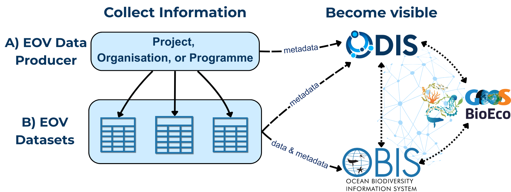
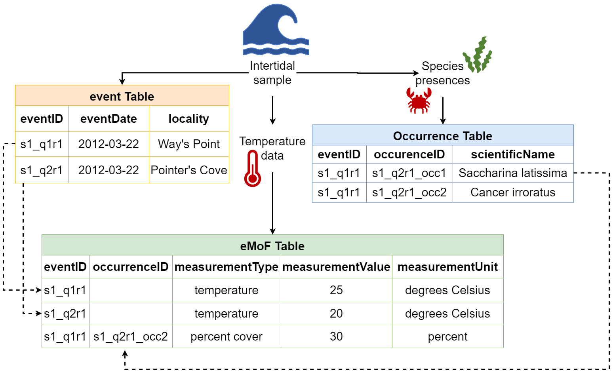
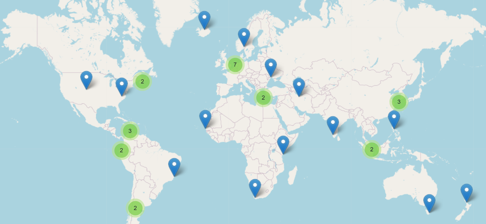

# Data and Information Management for EOVs

The GOOS approach to data management is aligned with open data and FAIR (Findable, Accessible, Interoperable, Reusable)[^1] practices. All EOV data and information is valuable, thus effective data management practices are essential to ensure it remains accessible and (re)usable for future generations. This document explains how to contribute **EOV data to the global ocean observing system** and ensure it is accessible, interoperable and sustained. We include instructions for different scenarios: an individual submitting data, or existing data centres. The recommendations below are aligned with the [IOC Strategic Plan for Ocean Data and Information Management](https://oceanexpert.org/document/31325) (2023–2029), the [UN Ocean Decade’s original Implementation Plan](https://unesdoc.unesco.org/ark:/48223/pf0000377082), its subsequent [Data and Information Strategy](https://unesdoc.unesco.org/ark:/48223/pf0000385542), as well as the latter’s upcoming Implementation Plan.

**Please follow these practices carefully, as EOV data FAIRness relies on compliance with the guidelines below.[^2]**

<h2 id="glossary">Glossary</h2>

<b>Metadata:</b> data or information that describes data. It's information that helps others find, understand, and properly use data - i.e. the "Who, What, When, and Where". In the context of EOV monitoring, this can refer to the information about a monitoring effort (e.g. programme, project, institution, etc.) or about the data produced from that monitoring effort.
  
<b>Dataset:</b> the actual data dervived from a sampling event, observation, measurement or other collection process. The specific digital file containing the raw and/or processed information. Preference is to align data to a standard, e.g. Darwin Core for biological data. Dataset metadata describes its content, e.g. taxonomic coverage, specific dates, technical methods used, specific geographic location, and individuals involved in sampling.
  
<b>Data Producer:</b> the entity responsible for generating or collecting EOV information. Can be an organization, project, institution, research group, or monitoring program. Metadata about data producers describes the <b>source</b> of the data, e.g. program name, geographic coverage, generic sampling approaches, sampling frequency.

Three main IOC-UNESCO digital systems help ensure global data compatibility:

* [Ocean Data and Information System (ODIS)](https://odis.org)[^3] - a federated system of ocean data sources.
* [Ocean Biodiversity Information System (OBIS)](https://obis.org/)[^4] - the world’s largest open-access repository for marine biodiversity data.
* The [GOOS BioEco Portal](https://bioeco.goosocean.org)[^5] - an open access, online platform that provides information on sustained ocean observing programs and which is strongly linked with both ODIS and OBIS.

Compatibility with these three systems ensures compatibility with the broader IOC-UNESCO digital ecosystem, further ensuring that EOV data will be visible to the global community and FAIR.

Before reading on, please note these important points:
<ul>
   <li>As a <b>minimum</b>, you must ensure information describing your EOV data and/or the entity collecting EOV data - the <b>data producer</b> - are visible in ODIS. Regardless of where the actual data is stored, <a href="#what-is-metadata">metadata</a> of its existence must be findable.</li>
   <li>BioEco EOV data is successfully managed if it is discoverable in the <b>GOOS BioEco Portal</b>. The BioEco Portal is the central point of access and coordination of BioEco EOV observing programmes. Data visible in the BioEco Portal will automatically be visible in ODIS and vice versa.</li>
   <li>When data is published to OBIS, it will also be visible in ODIS and the BioEco Portal. You do not need to publish it again elsewhere to enter these systems.</li>
</ul>

Please note the differentiation between the **EOV datasets** and the **EOV data producers** throughout this document (see <a href="#what-is-metadata">Glossary</a>). This distinction is made to emphasize that both the data and its source \- the data producer \- need to be managed and made visible.

The following points summarise the main data management steps:
<ol>
<li><b>Confirm discoverability: Check if the data producers (e.g., organisation, programme, project, etc.) and datasets are already visible in ODIS and the BioEco Portal as applicable</b></li>
<li><b>Become discoverable: Prepare the required metadata about the data producer and the datasets</b></li>
<li><b>Publish EOV data (e.g. OBIS) </b></li>
<li><b>Verify discoverability</b></li>
</ol>

Not all steps may be relevant for you, but <b>being discoverable (Step 1+2) is the minimum required</b> to ensure your data contributes to EOVs.

*Figure 1\. High-level example of data and metadata flows to ensure A) EOV data producers and B) EOV datasets become visible in the IOC Digital Ecosystem. Note the links between OBIS, GOOS BioEco Portal, and ODIS \- data visible in the former* two *will be visible in ODIS.*

<h2 id="1-confirm-discoverability">1. Confirm Discoverability</h2>

Before initiating data flow, you must ensure that key metadata about the EOV data producer (i.e. the project, programme, or organisation) is up to date, verifiable, and FAIR within the IOC-UNESCO digital ecosystem. Follow these steps:

1. **Check if record already exists:** Search the [ODIS Catalogue](https://catalogue.odis.org/) and [BioEco Portal](https://bioeco.goosocean.org/)
   * A record exists? Verify information is up to date (see [Part 2: Prepare Data Producer Metadata](#2-prepare-data-producer-metadata)), then skip to step 3
   * Not found? Continue to step 2.

2. **Register in IOC’s [Ocean Expert (OE)](https://www.oceanexpert.org/)**: Create a personal and/or organisational account in OE. OE allows you to link persistent identifiers (e.g. ORCiD or ROR), which ensure data traceability. OE entries also appear in ODIS automatically, ensuring another layer of broad discoverability
   * *Note: Account approval takes 1-2 business days. Complete your profile once approved.*
     * OE accounts are email based and thus can only be managed by the person it describes, or through an organisational email for organisations.

3. **Register your data producer**: Submit or update a record using the [**EOV Metadata Application**](https://eovmetadata.obis.org/) (see Part 2 for guidance). This automatically makes your entry visible in ODIS, but a GitHub account is required.
   * You may also add a record directly via the ODIS Catalogue, including the BioEco Portal and EOVs as keywords as relevant. Note that this requires technical knowledge of managing JSON and sitemap files, guidance is outlined in the [ODIS Book](https://book.odis.org/gettingStarted.html).
   * You may contact ODIS Helpdesk at [info@odis.org](mailto:info@odis.org), or post an issue on the [ODIS GitHub repository](https://github.com/iodepo/odis-arch).

4. **Already hosting a data portal?**: If you or your organisation hosts an independent data portal or uses an existing repository[^6] for EOV data, check whether it's already connected to ODIS. If it isn't, ask the repository admin to contact [info@odis.org](mailto:info@odis.org).

<h2 id="2-become-discoverable-prepare-data-producer-metadata">2. Become Discoverable: Prepare Data Producer Metadata</h2>

Detailed metadata about the data producer is essential to help others find and understand the EOV monitoring work being done around the world, assess its relevance, credit the right people, and identify collaboration opportunities. The GOOS BioEco Portal uses this information to map who is monitoring which EOVs and where, and is being developed to also display EOV datasets published to OBIS.

<h3 id="minimum-required-metadata">Minimum required metadata</h3>

| Field | Description |
| :----- | :----------- |
| Title/Name | Name of the project, programme, organisation, or other group conducting sustained EOV monitoring |
| Abstract or description | Brief description of the data producer |
| Landing page URL | A stable link to more information about the data producer |
| Contact Email | A point of contact, could be an individual, general inquiries, helpdesk, etc. |
| EOVs Keywords | The specific EOVs being monitored |
| Temporal coverage | The start and end date of the monitoring efforts; end date is optional if efforts are ongoing |
| Geographic location | The general location where monitoring takes place (e.g. bounding box, point location) |
| Sampling approach | The general methodological approach used, ideally mapped to GOOS Platform types (e.g. [platform family](https://www.ocean-ops.org/api/help/?param=platformfamily)) |

<h3 id="how-to-submit">How to Submit</h3>

Use the [EOV Metadata Application](https://eovmetadata.obis.org/) — it walks you through the required fields, generates the necessary JSON-LD file, and submissions become visible directly in ODIS and the BioEco Portal. No technical knowledge is required but a GitHub account is required to use the tool.

> If you're comfortable with JSON-LD, you can create the metadata files yourself. You'll also need a sitemap pointing to them and an entry in the ODIS Catalogue. See the [ODIS Book](https://book.odis.org/gettingStarted.html) for detailed guidance.

**Have an existing entry in the BioEco Portal?** The BioEco Portal has recently migrated to a new submission workflow, so existing entries may need to be transferred. Please contact [helpdesk@obis.org](mailto:helpdesk@obis.org) with the GitHub usernames that should have edit access, and we'll get you set up.

**Dataset metadata** (as opposed to data producer metadata) should be submitted directly to the repository where the data is hosted (e.g. OBIS). Dataset metadata may include but is not limited to information about the taxonomic coverage, temporal and geographic area, sampling methods used, people involved, and the project producing the data (including identifiers to link the dataset with the data producer).  

<h2 id="3-prepare-and-publish-eov-data">3. Prepare and Publish EOV Data</h2>

We encourage the “Publish once harvest many times” principle: publish your data to one trusted repository, and it will flow automatically to connected systems. Where you publish depends on your data type, but the repository must be interoperable with the data systems used by GOOS, IODE, and other IOC entities.

You have three main options:

<ol type="a">
  <li><a href="#3a-publish-bioeco-data-to-obis">Publish BioEco data directly to OBIS</a></li>
  <li><a href="#3b-connect-existing-data-portals-with-obis">Connect an existing data portal to OBIS</a></li>
  <li><a href="#3c-publish-non-bioeco-data">Publish non-BioEco data</a></li>
</ol>

<h3 id="3a-publish-bioeco-data-to-obis">3a. Publish BioEco Data to OBIS</h3>

OBIS (Ocean Biodiversity Information System) is the recommended repository for all observation-based BioEco datasets, including those derived from field samples, acoustic surveys, and DNA sequencing.

**Why OBIS?** All data in OBIS follows the international  **Darwin Core** (DwC, [https://dwc.tdwg.org/](https://dwc.tdwg.org/)) data standard, which ensures datasets are consistent, interoperable, and discoverable across global systems. You don't need to be familiar with the standard to get started, but we recommend using  **using DwC terms** ([https://dwc.tdwg.org/terms/](https://dwc.tdwg.org/terms/)) **as column names** in your data files from the outset if possible, as this will simplify the process.

> Note: Data published to OBIS can be **automatically shared with GBIF (Global Biodiversity Information Facility),** so you do not need to submit separately.

Dataset metadata aligns with **Ecological Metadata Language** ([https://manual.obis.org/eml.html](https://manual.obis.org/eml.html)), however you do not need knowledge of the metadata language because the publishing tool used by OBIS, called the Integrated Publishing Toolkit (IPT), uses a form-based interface to create the necessary files for you.

Raw supporting data (e.g. images, DNA sequences) should be deposited in an appropriate repository according to the repository's formatting standard (e.g.<a href="https://www.ncbi.nlm.nih.gov/">NCBI</a>, <a href="https://ecotaxa.obs-vlfr.fr/">EcoTaxa</a>, image hosting platforms, regional or national repositories, etc.), with links to these resources included in you DwC dataset. The <a href="https://manual.obis.org/">OBIS Manual</a> provides comprehensive guidance on how to align to DwC standards. OBIS regional and thematic nodes are also available to assist you with data formatting.

**Minimum metadata required for OBIS datasets:**

| Field | Notes |
| :---- | :---- |
| Title | Descriptive name for the dataset |
| Abstract or description | Brief description of the dataset |
| Citation | (can be automatically generated on the IPT) |
| Contact point | Person or team responsible |
| EOV keyword(s) | The EOVs covered by the dataset, use controlled vocabulary |

**Minimum data required for OBIS datasets:**

| Field | Notes |
| :---- | :---- |
| Coordinates | of a sampling event and/or biological observation, in decimal degrees |
| Date | of the observation (YYYY-MM-DDTHH:mm:ss) |
| Taxon Name | of the taxon observed, to the lowest possible rank identified (higher ranks are accepted) |
| Present / absent | (DwC term occurrenceStatus) |
| observation type | (e.g. human vs machine observation, DNA-based; DwC term basisOfRecord) |
| Unique observation identifiers | for all taxonomic observations (DwC term occurrenceID) |

To **link a dataset back to its data producer**, enter the project information - including the **producer's identifier** - in the relevant section of the IPT metadata form. We strongly recommend doing this to maintain clear connections between datasets and the programmes that produced them. You can always go back and add an identifier if you do not have one at the time of dataset publication.

<h4 id="how-darwin-core-structures-data">How Darwin Core structures data</h4>

DwC organises data into linked tables. Tables are connected by shared identifiers (eventIDs and occurrenceIDs), so data from different tables can be reliably combined. See Figure 2 for an example.

The tables currently implemented by OBIS are:

* ***Sampling-Event***: Where, when, and how sampling occurred (e.g. location, depth, methods, etc.)
* ***Occurrence***: What was observed (biological records, sequence-based detections, historical observations)  
* ***ExtendedMeasurementOrFacts***: Any biotic/abiotic measurements, sampling facts, environmental conditions, or relevant information  
* ***DNADerivedData***: Sequences, primers, and other molecular information

*Figure 2\. A simplified example of the Darwin Core structure, demonstrating how data in Sampling-Event, Occurrence, and extendedMeasurementOrFact (eMoF) tables can be linked by eventIDs and occurrenceIDs. Note the example does not show all required fields.*

<h4 id="getting-help-with-obis">Getting help with OBIS</h4>

The OBIS Manual, OBIS Nodes, or the OBIS helpdesk ([helpdesk@obis.org](mailto:helpdesk@obis.org)) can assist with formatting and publishing. OBIS Nodes can assist data providers with data formatting. You may provide them with your dataset and associated metadata in any format (e.g. Excel spreadsheets) and they can assist in transforming it to Darwin Core. We recommend identifying a regional or thematic Node to help you (Figure 3). If your dataset is incomplete or historical, don't be discouraged - OBIS Nodes can also help assess what's usable and how to handle gaps. For historical data, the [Oceans Past Initiative](https://oceanspast.org/) is a thematic OBIS Node that specifically handles historical marine data.

The [EOV Metadata Submission Tool](https://eovmetadata.obis.org/home) is also under development to offer the option of uploading a file aligned to a user-friendly "EOV-format", and guide you through the process of converting your data into DwC tables.

<h4 id="data-licensing">Data licensing</h4>

All data published to OBIS is open-access. However datasets may select one of three Creative Commons licenses: **CC0, CC BY, CC BY-NC**. For details on the data policy of OBIS, see the [OBIS website](https://obis.org/data/datapolicy/) and the [OBIS Manual](https://manual.obis.org/policy.html).

<h3 id="3b-connect-existing-data-portals-with-obis">3b. Connect Existing Data Portals with OBIS</h3>

If your institution already publishes data through its own portal or repository, it may be possible to connect that system to OBIS.  To do this, the **data must be structured in Darwin Core format,** and the portal needs to be connected to an Integrated Publishing Toolkit (IPT) - the software OBIS uses to harvest data.

If your portal isn't already connected, this typically involves a workflow that:

1. Extracts the data from your institutional repository,  
2. Formats it to align with DwC, and  
3. Transfers it to an IPT, which OBIS can then harvest

For help setting this up, contact the OBIS Secretariat at ([helpdesk@obis.org](mailto:helpdesk@obis.org)), or a regional/thematic [OBIS Node](https://obis.org/contact/). If you publish data from systems like NCEI or ERDDAP, becoming an OBIS Node (or partnering with one) may be the best path forward. The OBIS Secretariat can  guide you through [the process](https://manual.obis.org/nodes.html#tor-of-obis-nodes), or connect you with an appropriate OBIS node (Figure 3).

<b>Already publishing to EMODnet or ICES?</b>
 
EMODnet Biology is managed through EurOBIS, a regional OBIS node - which means that data in EMODnet Biology is already flowing into OBIS. No additional steps are needed.
 
<a href="https://www.ices.dk/">ICES (International Council for the Exploration of the Sea)</a> contributes data to EMODnet Biology, Physics, and Chemistry, so some biological data may already reach OBIS via EurOBIS. However, this pathway is not automatic or guaranteed for all datasets. We recommend checking whether your data is already visible in OBIS. If it isn't, publishing directly through an OBIS node is the most reliable route.
 
For EMODnet Physics and Chemistry data not covered by the above, a direct connection to OBIS does not currently exist. At minimum, ensure your data producer is registered in ODIS (see Section 1) so your work remains findable.

<h3 id="3c-publish-non-bioeco-data">3c. Publish Non-BioEco Data</h3>

Non biological data collected must also be made FAIR. As a reminder, we encourage any non-BioEco data that was taken at the same time as BioEco data to be published together in OBIS. To do this, you can utilise the ExtendedMeasurementOrFact table. Using this approach will avoid datasets being split into several separate datasets, which are then difficult to combine again. Ensure identifiers for the associated projects, people, institutions, etc. are included in all metadata so they can be connected. Specific details on using this table are outlined in the [OBIS Manual](https://manual.obis.org/format_emof.html).

For guidance on data flows for physical or biochemical data not collected alongside BioEco data, please refer to the [relevant EOV specification sheet](https://goosocean.org/what-we-do/framework/essential-ocean-variables).

Metadata about observing platforms should be made available through the GOOS [OceanOPS](https://www.ocean-ops.org/). See [https://www.ocean-ops.org/metadata/](https://www.ocean-ops.org/metadata/#background) for guidance.

<h2 id="4-verify-discoverability">4. Verify Discoverability</h2>

To verify that your (meta)data are Findable (the F of FAIR), check that the name of your entry appears in the [ODIS Dashboard](http://dashboard.odis.org/) and/or the [GOOS BioEco Portal](https://bioeco.goosocean.org/).

To verify that BioEco datasets published to OBIS are accessible (the A of FAIR), search by dataset name through the OBIS Mapper ([https://mapper.obis.org/](https://mapper.obis.org/)) or the Homepage portal ([https://obis.org/search?entity=dataset](https://obis.org/search?entity=dataset)). The GOOS BioEco Portal harvests data producer metadata directly from ODIS and from the EOV Metadata App, and populates it into the Portal. This connection is currently a work in progress, but will streamline the metadata sharing process.

<h2 id="help-resources">Help Resources</h2>

* EOV Metadata Submission tool: [https://eovmetadata.obis.org/](https://eovmetadata.obis.org/)
* Ocean Best Practices System – Search for best practices: [https://search.oceanbestpractices.org/](https://search.oceanbestpractices.org/)

**ODIS**

* General help: [https://book.odis.org/index.html](https://book.odis.org/index.html)  
* Connecting to ODIS: [https://book.odis.org/gettingStarted.html](https://book.odis.org/gettingStarted.html)  
* ODIS Catalogue of Sources: [https://catalogue.odis.org/](https://catalogue.odis.org/)  
* Ocean Info Hub: [https://oceaninfohub.org/](https://oceaninfohub.org/)
* Schema.org framework [https://schema.org/](https://schema.org/)

**OBIS**

* OBIS Manual: [https://manual.obis.org/](https://manual.obis.org/)  
* OBIS YouTube data formatting and publishing videos: [https://www.youtube.com/playlist?list=PLlgUwSvpCFS4TS7ZN0fhByj\_3EBZ5lXbF](https://www.youtube.com/playlist?list=PLlgUwSvpCFS4TS7ZN0fhByj_3EBZ5lXbF)  
* Darwin Core term reference list: [https://dwc.tdwg.org/terms/](https://dwc.tdwg.org/terms/)  
* WoRMS taxonomy: [https://www.marinespecies.org/](https://www.marinespecies.org/)  
* DwC spreadsheet template generator [https://www.nordatanet.no/aen/template-generator/config%3DDarwin%20Core](https://www.nordatanet.no/aen/template-generator/config%3DDarwin%20Core)  
* BioData Guide with example code for transforming datasets to DwC: [https://ioos.github.io/bio\_data\_guide/](https://ioos.github.io/bio_data_guide/)

**GOOS BioEco Portal**

* Documentation [https://iobis.github.io/bioeco-docs/](https://iobis.github.io/bioeco-docs/)  
* Access [https://bioeco.goosocean.org/](https://bioeco.goosocean.org/)

---

[^1]:  Wilkinson et al. 2016 <https://doi.org/10.1038/sdata.2016.18>

[^2]:  In evaluations of programmes, projects, or other initiatives which claim EOV data generation, evaluators are encouraged to verify that data is discoverable and accurately represented in the GOOS BioEco Portal.

[^3]:  ODIS, part of IOC-UNESCO’s International Oceanographic Data and Information Exchange (IODE), is a global federation of data systems sharing interoperable (meta)data about holdings, services, and other resources to enhance cross-domain data accessibility.

[^4]:  OBIS is a global biodiversity database and IOC-UNESCO IODE component, connecting \+30 nodes, \+1000 institutions, and 99 countries, interoperating with other major biodiversity hubs like GBIF and makes data visible in ODIS as an ODIS node.

[^5]: The GOOS BioEco Portal focuses on BioEco EOVs and displays metadata regarding marine data producers (e.g., monitoring programmes, institutions, etc.) as well as the data they produce. Data published to OBIS that are tagged with EOV keywords become visible in the Portal.

[^6]:  E.g. phylogenetic/functional DNA sequence data in the European Nucleotide Archive, biological and associated data in OBIS, images in institutional repositories, acoustic data in a regional data hub, etc.
